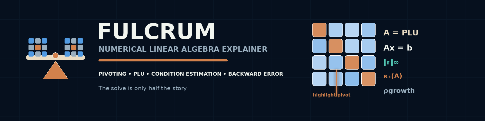
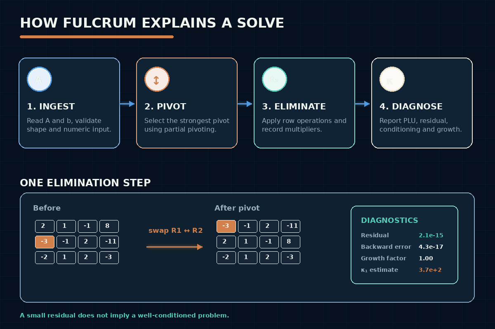

# Fulcrum — Explainable Numerical-Methods CLI



*Ships as the `numsolve` CLI/library — see below.*


The original program (interactive-only, fixed-epsilon Gaussian
elimination) has been moved out of this repository into a personal
academic-archive repo. `TODO`: link to that repo once it's published.

## Overview

Raw Gaussian elimination is a solved problem — numpy, LAPACK, and dozens of
web calculators already do it. Rebuilding a solver as a "tool" would be
pointless. **numsolve** is instead an explainable numerical-methods CLI:
something a student debugging their own hand-worked elimination, or a
numerical-methods course, would actually reach for. It:

- Records every elementary row operation in standard textbook notation
  (`Ri <-> Rj`, `Ri <- Ri - m·Rj`) and every pivot-selection decision —
  not just before/after matrix snapshots.
- Exposes Gaussian elimination and PLU factorization as **one process
  viewed two ways**, not two independent algorithms that happen to agree:
  the recorded elimination multipliers *are* `L`, directly.
- Diagnoses conditioning (an estimated κ₁ via the classic Hager/Higham
  1-norm estimator, not a fabricated "stability: yes/no" verdict), pivot
  quality (did partial pivoting rescue a near-zero divide?), element
  growth during elimination, and solution residual.
- Uses a **scale-aware** numerical-zero tolerance instead of the original
  program's fixed `1e-9` epsilon, which is provably wrong for matrices at
  a different scale (see "Design decisions").

## Problem Statement

Implement Gaussian elimination robustly enough to classify all three
solution cases (unique/infinite/none), and — the harder, more useful
problem — make the *why* of every step and every numerical judgment call
visible and checkable, instead of only printing a final answer.

## Design decisions

**Why a scale-aware tolerance, not a fixed epsilon?** The original
program used `EPSILON = 1e-9` as an absolute cutoff for "this pivot is
zero." That's wrong in general: `A = 1e-20 * I` is a perfectly
well-conditioned matrix (κ₁ = 1) whose every entry is smaller than
`1e-9`, so a fixed-epsilon solver misjudges it as singular. numsolve uses
`τ = machine_epsilon × n × ‖A‖∞` instead — a threshold that scales with
the matrix itself. This is proven correct by
[`tests/test_elimination.cpp`](tests/test_elimination.cpp)'s
scale-invariance regression test, which is exactly the case that broke
first during development — an early version of
this tolerance function still had a fixed absolute floor of one machine
epsilon "just in case", which silently reintroduced the identical bug for
any matrix with entries smaller than ~2.22e-16. Removing the floor
entirely (a genuinely zero matrix still correctly yields τ=0 and finds no
pivot) fixed it.

**Why Gaussian elimination and PLU factorization aren't presented as two
methods.** With partial pivoting, Gaussian elimination on `A` *is*
computing `PA = LU`: the multipliers eliminated at each step are exactly
`L`'s entries, and the row-echelon result is `U`. Presenting them as
"Method 1 vs. Method 2, cross-checked" would be pedagogically misleading
(they aren't independent). Instead numsolve verifies the *factorization
identity* (`‖PA − LU‖∞`) and the *solution residual* (`‖Ax − b‖∞`)
separately — two real mathematical invariants, per the research this was
built against, rather than a fake "two algorithms agree" cross-check.

**Why an estimated condition number, not an exact one.** Computing an
exact κ via SVD, or by explicitly forming `A⁻¹`, is exactly the kind of
dependency-heavy numerical-library territory this project deliberately
avoids (no BLAS/LAPACK). Instead numsolve implements the classical
**Hager (1984) / Higham (1988) 1-norm estimator**: it estimates `‖A⁻¹‖₁`
using a handful of triangular solves against the already-computed `L`/`U`
factors, never forming `A⁻¹`. It's reported explicitly as an *estimate*
(`estimated kappa_1(A)`), and verified in
[`tests/test_condition.cpp`](tests/test_condition.cpp) against a diagonal
matrix whose true κ₁ is known exactly by hand (it reproduces it closely),
the identity matrix (κ₁ = 1 exactly), a singular matrix (reported as
singular, not a bogus finite number), and a Hilbert matrix (correctly
flagged as severely ill-conditioned).

**Why the CLI dropped interactive stdin prompts.** The original program
only accepted input as a sequence of interactive prompts, which made it
untestable — there is no way to script "run the solver against this
matrix" without a pseudo-terminal. numsolve reads a plain augmented-matrix
text file, a canonical JSON file, or stdin, which is what actually enabled
[the automated test suite](tests/) below to exist at all.

## Tools and Technologies

- C++20, CMake, MinGW g++ (same toolchain as the sibling
  [Penumbra](../../cybersecurity/penumbra/) project)
- [nlohmann/json](https://github.com/nlohmann/json) for the JSON input/output format
- [Catch2 v3](https://github.com/catchorg/Catch2) for the test suite

## Features

- Full elimination trace with textbook `Ri <-> Rj` / `Ri <- Ri - m·Rj`
  notation and pivot-candidate tables.
- Rank-based system classification (unique / infinite / no solution) with
  the actual `rank(A)` and `rank([A|b])` shown, not just a verdict.
- PLU view: `L`, `U`, the permutation, and a `‖PA − LU‖∞` verification.
- Numerical diagnostics: Hager/Higham κ₁ and rcond₁ estimate, row-swap
  count, smallest pivot used, "worst candidate ratio" (how close partial
  pivoting came to rescuing a near-zero divide), element growth factor,
  and solution residual (absolute and relative).
- Plain-text augmented-matrix format, canonical JSON format, and stdin,
  alongside text and JSON output.
- 28 Catch2 tests covering elimination correctness, the scale-invariance
  regression, PLU/residual invariants, the condition estimator (against
  hand-computable references), and both parsers' fail-closed paths.

## How It Works



## Repository Structure

```text
fulcrum/
  README.md, CHANGELOG.md
  CMakeLists.txt, build.sh
  include/numsolve/   matrix, trace, elimination, linalg, condition, diagnostics, parser, report
  src/                implementations + main.cpp (CLI)
  tests/              28 Catch2 tests
  examples/
    textbook/          unique / no-solution / infinite-solutions
    ill-conditioned/   Hilbert(5) example
  project.yaml
```

The original interactive program, its sample data, and its screenshots
are preserved outside this repository (see the note at the top of this
README).

## Building from source

Requires CMake, MinGW g++, and the vcpkg instance already set up for
`fwlint` (see that project's README for the one-time vcpkg setup):

```bash
./build.sh
```

Produces `build/numsolve.exe` and `build/numsolve_tests.exe`.

## Usage

```bash
numsolve solve <file|-> [--steps] [--view elimination|plu] [--diagnostics]
                        [--format text|json] [--all]
```

Input is a plain augmented-matrix text file (`n` on the first line, then
`n` rows of `n` coefficients, an optional `|`, and one constant), a
`.json` file (`{"A": [[...],...], "b": [...]}`), or `-` for stdin.

### Worked example (real, captured output)

```text
$ numsolve solve examples/textbook/unique.txt --all
A =
[     2.0000     1.0000    -1.0000 ]
[    -3.0000    -1.0000     2.0000 ]
[    -2.0000     1.0000     2.0000 ]

...
Step 1 -- choose pivot in column 1
Candidates:
  R1  2.0000
  R2  -3.0000  <- largest magnitude
  R3  -2.0000
Partial pivoting selects R2.
R1 <-> R2
m = -0.6667
R2 <- R2 + 0.6667·R1
m = 0.6667
R3 <- R3 - 0.6667·R1
...
Solution:
  x1 = 2
  x2 = 3
  x3 = -1

Verification: ||P*A - L*U||_inf = 1.11e-16
...
Conditioning (Hager/Higham 1-norm estimate)
  estimated kappa_1(A)     77.000000
Solution verification
  ||Ax-b||_inf             8.8818e-16
```

### A real lesson: tiny residual, terrible conditioning

Running the 5×5 Hilbert matrix example
([`examples/ill-conditioned/hilbert5.txt`](examples/ill-conditioned/hilbert5.txt),
constructed so the true solution is the all-ones vector) shows exactly the
distinction the diagnostics panel exists to teach:

```text
Solution:
  x1 = 1
  x2 = 0.999999
  x3 = 1.00001
  x4 = 0.999991
  x5 = 1

estimated kappa_1(A)     9.4365e+05
Solution verification
  ||Ax-b||_inf             2.2204e-16
```

The residual is essentially machine-zero — the computed `x` satisfies
`Ax = b` almost perfectly — yet the solution itself has visibly drifted
from the true all-ones answer (`x3 = 1.00001`, not `1`), *because* the
matrix is severely ill-conditioned (κ₁ ≈ 9.4×10⁵). A small residual does
not imply an accurate solution when the problem itself is sensitive to
input perturbation. That's the real, reproducible teaching point behind
having both diagnostics in the same tool.

## How to Review

1. Start with this README, then read
   [`src/elimination.cpp`](src/elimination.cpp) (the single elimination
   process everything else is a view of) and
   [`src/condition.cpp`](src/condition.cpp) (the Hager/Higham estimator).
2. Run `./build.sh` then `./build/numsolve_tests.exe` — 28 tests, all passing.
3. Run the worked example and Hilbert-matrix example above.
4. The original, interactive-only, fixed-epsilon program is archived
   outside this repository (see the note at the top of this README) if
   you want to compare against it.

## Testing

```text
$ ./build/numsolve_tests.exe
All tests passed (70 assertions in 28 test cases)
```

Coverage: matrix/vector norms, unique/infinite/no-solution classification,
the "requires pivoting" case, the scale-invariance regression (the bug
described in "Design decisions"), `PA≈LU` and residual invariants, `L`
unit-lower/`U` upper-triangular structure, the pivot-rescue diagnostic,
the condition estimator against hand-computable references (diagonal,
identity, singular, Hilbert), and both input parsers' happy and
fail-closed paths.

## Original Results (original artifact)

Preserved from the original submission, now archived outside this
repository (see the note at the top of this README). The three original
sample datasets (unique, infinite-solutions, no-solution) were each
independently reproduced by `numsolve solve` on the equivalent input.

## Limitations

- **Square systems only.** Rectangular `A` is rejected with a clear error
  rather than silently handled — the PLU/condition-estimation machinery
  is only meaningful for a square, potentially-invertible `A`. The
  original program was square-only too; this isn't a
  regression, just an explicit, enforced boundary now.
- **No arbitrary-precision or symbolic arithmetic** — IEEE-754 `double`
  throughout, same as the original.
- **Condition estimate, not exact value** — see "Design decisions."
  `--diagnostics` always labels it as an estimate.
- **No LaTeX/Markdown export of the trace** yet, despite being genuinely
  useful for technical writeups.
- **No CI pipeline has run against this code** — not pushed to GitHub in
  this task.

## Future Enhancements

- LaTeX export of the elimination trace for lecture notes/homework writeups.
- QR factorization as a genuinely independent second solving method (a
  real cross-check, unlike GE vs. PLU) for the ill-conditioned case.
- A `--tolerance <value>` override flag (the scale-aware default can
  already be overridden programmatically via `factorize`'s second
  argument; wiring it to the CLI is straightforward future work).
- A property-based/fuzzed test corpus beyond the current hand-built fixtures.

## Safety and Privacy

- No real secrets, credentials, or private keys are included.
- No private user data is included; all matrices are synthetic/textbook examples.

## Ethical Notice

This project only performs in-memory numerical computation on
synthetic/textbook data. Intended strictly for learning.
